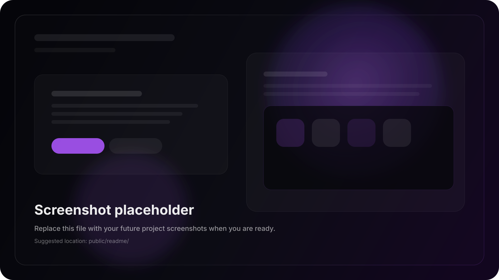

# Pankaj Kashyap Portfolio

A cinematic, single-page portfolio built with Next.js that blends motion, storytelling, and practical contact flows into one polished experience. This site is designed to feel like a personal product launch: fast, expressive, and easy to explore.



## What You Will Find

- A bold landing page with a hero section, animated background, and a direct "Hire Me" path to the contact page.
- Modular portfolio sections for about, skills, experience, projects, services, and contact.
- A dashboard-style experience for browsing deeper content in a more interactive format.
- A contact flow wired to Resend so messages can be delivered by email.
- Admin and dashboard routes that make the portfolio feel more like an interactive product than a static resume.

## Key Features

- Animated hero landing page with parallax and reveal effects.
- Contact-first navigation that makes it easy for visitors to reach out.
- Modular content stored in `src/data` for simple editing.
- Dedicated routes for portfolio categories like `/about`, `/skills`, `/projects`, and `/contact`.
- SEO metadata configured in the root layout and shared SEO config.
- Prisma schema ready for storing projects, experience, skills, settings, and admin users.

## Tech Stack

- Next.js 16
- React 18
- TypeScript
- Tailwind CSS 4
- Framer Motion
- Zustand
- Prisma
- Resend
- Lucide React
- Lenis
- GSAP

## Screenshot Area

This README includes a placeholder image so you already have a visual slot for future screenshots.

When you are ready, replace the placeholder with real images in `public/readme/` and update this section with:

- A full landing page screenshot
- A mobile view screenshot
- A projects or dashboard screenshot
- A contact page screenshot

Example structure:

```text
public/readme/
  portfolio-screenshot-placeholder.svg
  landing-page.png
  mobile-view.png
  projects-view.png
  contact-view.png
```

## Getting Started

### 1. Install dependencies

```bash
npm install
```

### 2. Add environment variables

Create a `.env.local` file in the project root and add:

```bash
DATABASE_URL="your_postgres_connection_string"
RESEND_API_KEY="your_resend_api_key"
```

### 3. Run the development server

```bash
npm run dev
```

Open `http://localhost:3001` in your browser.

## Available Scripts

- `npm run dev` - start the development server on port `3001`
- `npm run build` - create a production build
- `npm run start` - run the production server
- `npm run lint` - run ESLint

## Project Structure

```text
src/
  app/               App Router pages and API routes
  components/        Sections, panels, layouts, animations, and UI pieces
  data/              Portfolio content and navigation data
  hooks/             Shared React hooks
  lib/               Utilities
  providers/         App-level providers
  store/             Zustand stores
  theme/             Theme configuration
public/              Static assets, images, PDFs, and screenshots
prisma/              Database schema
```

## Important Pages

- `/` - landing page
- `/dashboard` - dashboard experience
- `/about`, `/skills`, `/education`, `/projects`, `/certifications`, `/contact` - deep-dive portfolio pages
- `/admin` - admin interface

## Content You Can Edit Quickly

Most of the visible content lives in the data files under `src/data/`.

- `src/data/personal.ts` - name, role, bio, hero copy, and focus areas
- `src/data/navigation.ts` - navigation links
- `src/data/projects.ts` - project content
- `src/data/experience.ts` - experience timeline
- `src/data/skills.ts` - skill list
- `src/data/socials.ts` - social links

## Contact Form

The contact section sends mail through the API route at `src/app/api/send/route.ts`.

If `RESEND_API_KEY` is missing, the form will fail gracefully and return a clear error message. Make sure the key is set before deploying.

## Database

This project includes a Prisma schema in `prisma/schema.prisma` with models for:

- `Project`
- `Experience`
- `Skill`
- `Setting`
- `AdminUser`

If you plan to use the database features, connect a PostgreSQL database and run your Prisma workflow as usual.

## Deployment Notes

- Make sure the environment variables are configured in your hosting platform.
- Upload the assets in `public/` before deploying if you want the hero image and PDFs to appear correctly.
- Confirm that your database and Resend credentials are available in production.

## Customization Tips

- Update `src/data/personal.ts` first if you want to change the profile text, hero copy, or contact details.
- Replace the placeholder screenshot image with real project screenshots when you have them.
- Add or remove sections by editing the route files and components under `src/components/sections/` and `src/app/`.

## Notes

This portfolio is intentionally built to feel personal, cinematic, and memorable. It is not just a list of links; it is a guided experience that makes it easy for someone to understand your work and contact you.
